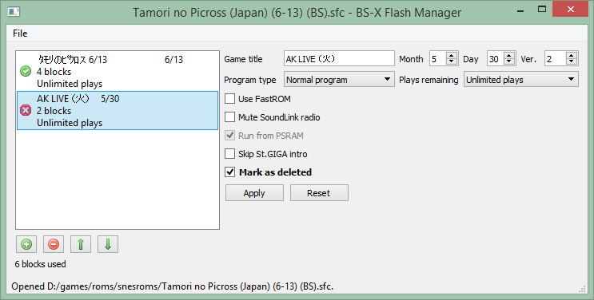

BS-X Flash Manager
==================
version 0.2.0

This is a small utility for managing the contents of BS-X / Satellaview memory packs.

What this utility can do:
* Add, remove, rearrange downloaded files in a memory pack
* Modify the properties of files in a memory pack
* Export files in a memory pack to single-file memory packs (individually or all at once)
* Automatically try to detect deleted files in the free space of a memory pack
* Allow recovering and exporting deleted files that were able to be detected
* Quickly dump memory packs over USB using the [INL Retro programmer](https://www.infiniteneslives.com/inlretro.php)

The utility can also save memory packs that are larger than the standard 8 blocks (megabits); in compatible emulators (such as bsnes-plus and bsnes/higan) the BSX software itself supports up to 32 blocks, with some limitations (a memory pack cannot contain more than one file that's larger than 4 blocks).

Building requires [Qt 5](https://www.qt.io) and [libusb](https://libusb.info), and can be built with either Visual Studio or Qt Creator/qmake. Official builds currently require the Visual Studio 2017 runtime.
